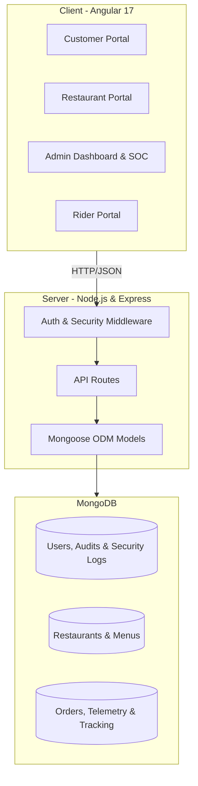
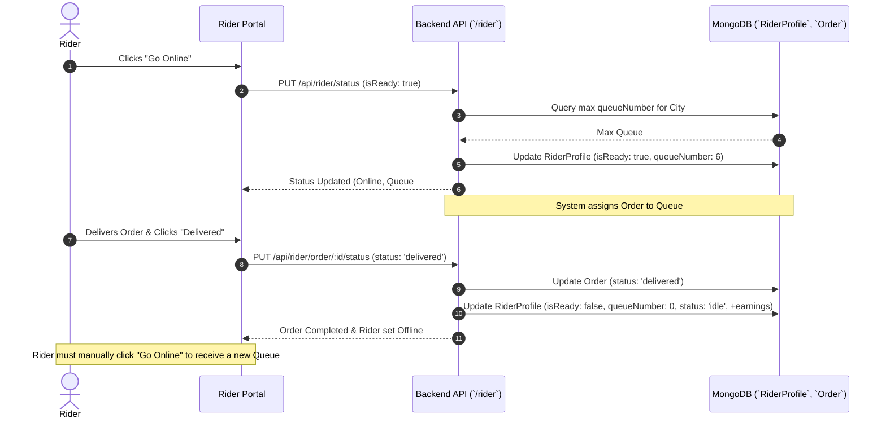

# 🌯 FoodFlow Delivery System - Complete System Specification & Documentation

Welcome to the official documentation for **FoodFlow**, a premium, full-stack food delivery platform. This document provides a comprehensive overview of the system's architecture, data models, workflows, security operations, and technical implementation.

---

## 🏗️ 1. System Architecture

FoodFlow follows a **client-server architecture** using the **MEAN stack** (MongoDB, Express, Angular, Node.js). It is designed to be scalable, maintainable, and provides a seamless real-time experience for multiple user types.

### High-Level Architecture Diagram


---

## 🛠️ 2. Technology Stack

### Backend
- **Node.js**: Runtime environment.
- **Express.js**: Web framework for building REST APIs.
- **MongoDB**: NoSQL database for flexible data storage.
- **Mongoose**: ODM for MongoDB schema validation, modeling, and lean querying.
- **JWT (JSON Web Tokens)**: Secure stateless authentication and authorization.
- **Bcrypt.js**: Industry-standard password hashing.
- **Dotenv**: Management of environment variables.

### Frontend
- **Angular 17**: Modern component-based framework with standalone and modular components.
- **RxJS**: For reactive programming and handling asynchronous data streams and state subjects.
- **TypeScript**: Ensuring strict type safety across the application.
- **Custom CSS & Glassmorphism**: Responsive, premium dark-themed UI design with rich micro-interactions.
- **Angular Router**: Managing complex navigation and route guards across four distinct portals.

---

## 📂 3. Project Structure

### Root Directory
```text
food-delivery-system/
├── client/                 # Angular Frontend Application
├── server/                 # Node.js/Express Backend Application
├── README.md               # Quick overview
├── SETUP.md                # Installation guide
├── STRUCTURE.md            # Directory map
└── DOCUMENTATION.md        # This comprehensive system specification guide
```

### Backend (`/server`)
- `server.js`: Entry point of the application. Initializes Express, middleware, and connects to MongoDB.
- `models/`: Mongoose schemas for all core entities and security logs (User, Restaurant, Order, RiderProfile, SecurityLog, etc.).
- `routes/`: Express router files defining all functional and administrative API endpoints.
- `middleware/`: Custom middleware including JWT verification, role authorization (`isAdmin`), and request auditing.
- `.env`: Sensitive configuration (Database URIs, Secret Keys, Ports).

### Frontend (`/client/src/app`)
- `components/`: UI modules organized by user role (admin, customer, restaurant, rider, auth).
- `services/`: API client services (`AdminService`, `AuthService`, `RiderService`, etc.) and shared state management.
- `app-routing.module.ts`: Navigation hierarchy, route definitions, and security guards.
- `app.module.ts`: Root module orchestrating components, interceptors, and dependencies.

---

## 👥 4. User Roles & Portals

FoodFlow is a multi-tenant platform with four distinct user roles, each featuring a tailored portal:

### 🛒 Customer Portal
- **Discovery**: Browse restaurants by city or category with real-time active status filtering.
- **Menu Interaction**: View detailed menus with item categories, pricing, and live aggregated item ratings/reviews.
- **Cart Management**: Add/remove items, calculate subtotals, delivery fees, and taxes dynamically.
- **Order Tracking**: Monitor order status through real-time state transitions ("Pending" → "Accepted" → "Preparing" → "Ready" → "Picked Up" → "Delivered").
- **Order History & Reviews**: View past orders and submit granular ratings and feedback for both orders and individual menu items.

### 🍳 Restaurant Portal
- **Profile Management**: Manage establishment name, description, address, operating city, and live operational status.
- **Menu Management**: CRUD operations for menu items. Instant toggle for item availability (in-stock/out-of-stock) and dynamic review metrics tracking.
- **Order Processing**: Real-time incoming order queue. Workflow actions to Accept/Reject orders and update preparation stages (`preparing`, `ready`).

### 🚴 Rider Portal
- **Queue & Dispatch Management**: Automated city-based queue number assignment upon going "Online".
- **Delivery Workflow**: View assigned orders ready for pickup, execute delivery navigation, and confirm delivery completion.
- **Automated Re-queueing**: Mandated offline state upon delivery completion (`delivered`), requiring riders to re-initiate online status for fair queue position allocation.
- **Earnings & Telemetry**: Track completed deliveries, total earnings, and live operational state (`idle`, `assigned`, `delivering`).

### 🛡️ Admin Dashboard & Security Operations Center (SOC)
- **Platform Analytics**: High-level live telemetry (Total users, restaurants, order volume, total revenue, database storage stats).
- **User Accounts Management**: Advanced role-based tab segregation (All, Customers, Restaurant Owners, Riders, Administrators) with reactive multi-field search (name, email, phone), city filtering, and dynamic order volume/join date sorting.
- **Comprehensive Data Inspection**: Deep-dive modal panels displaying complete user records, rider telemetry, restaurant catalogs, and customer order histories in a single unified view.
- **Threat Monitoring & SOC**: Live security log tracking, multi-device login auditing (IP/User-Agent tracking), automated IP/account blocking, force session termination, and inactivity timeouts.
- **System Configuration**: Administrative control over global Cities, Categories, Broadcast Notifications, and Promotional Sliders.

---

## 💾 5. Data Model (Database Schemas)

### User Schema (`models/User.js`)
- `name`, `email`, `password`, `role` ('admin', 'customer', 'restaurant', 'rider').
- `phone`, `address`, `city`, `profileImage`, `isActive`, `isBlocked`, `forceLogout`.
- `apiRequestsCount`, `loginAttempts`, `lastLoginAt`.
- `loginDevices`: Array tracking `ipAddress`, `userAgent`, and `lastLogin` timestamps.

### Restaurant Schema (`models/Restaurant.js`)
- `userId`: Reference to User owner account.
- `name`, `description`, `address`, `city`, `phone`, `image`.
- `rating`: Aggregated rating score.
- `isActive`: Administrative approval flag.

### Order Schema (`models/Order.js`)
- `customerId`, `restaurantId`, `riderId`, `assignedRiderId`.
- `items`: Array of ordered items (`menuItemId`, `name`, `price`, `quantity`).
- `status`: Enum (`pending`, `accepted`, `preparing`, `ready`, `pickedup`, `delivered`, `cancelled`).
- `totalAmount`, `deliveryFee`, `deliveryAddress`, `phone`, `notes`.
- `review`: Object containing `rating`, `comment`, and `createdAt`.

### MenuItem Schema (`models/MenuItem.js`)
- `restaurantId`: Owner restaurant reference.
- `name`, `price`, `description`, `category`, `image`.
- `rating`, `reviewCount`: Dynamically recalculated review metrics.
- `isAvailable`: Inventory status toggle.

### RiderProfile Schema (`models/RiderProfile.js`)
- `userId`: Reference to Rider user account.
- `city`, `status` (`idle`, `assigned`, `delivering`).
- `isReady`: Online dispatch readiness flag.
- `queueNumber`: Dynamic FIFO queue position.
- `earnings`, `completedTrips`, `currentOrderId`.

### Security & Audit Schemas (`models/SecurityLog.js`, `UserLog.js`, `BlockedIP.js`)
- **SecurityLog**: Tracks `eventType`, `ipAddress`, `userAgent`, `endpoint`, `severity`, and `details`.
- **UserLog**: Tracks granular API requests, methods, and response statuses per user.
- **BlockedIP**: Maintains blacklisted `ipAddress` records and block `reason`.

---

## 🔄 6. Working Model & Flow

### A. Authentication & Session Flow
1. User submits credentials to role-specific login endpoints.
2. Server validates password against Bcrypt hash and issues a signed **JWT**.
3. **Client Session Storage**:
   - **Customers, Restaurants, Riders**: Tokens stored in `localStorage`.
   - **Admins**: Tokens stored in `sessionStorage` for volatile, high-security session handling.
4. Client attaches JWT in the `Authorization: Bearer <token>` header for all protected API calls.

### B. Rider Queue & Dispatch Automation Flow


### C. Dynamic Review Analytics Flow
1. Customer submits an order review via `POST /api/customer/order/:id/review`.
2. Backend updates the `Order` document with rating and comments.
3. System iterates through all `items` in the order, querying each corresponding `MenuItem`.
4. Backend recalculates `rating` and increments `reviewCount` for each menu item, persisting updates to MongoDB.
5. Customer and Restaurant portals immediately reflect updated item ratings on product cards.

### D. Threat Monitoring & SOC Auditing Flow
1. Every incoming API request passes through auditing middleware.
2. The system increments `apiRequestsCount` for the authenticated user and logs device signatures (`ipAddress`, `userAgent`).
3. If an unauthorized access attempt occurs (e.g., non-admin accessing `/api/admin`), a `SecurityLog` is generated with `high` severity.
4. The Admin SOC dashboard polls security logs, allowing administrators to click **"Block IP"** or **"Force Logout"**, instantly updating `BlockedIP` or setting `forceLogout: true` on the user account.

---

## 🌐 7. API Reference (Core Endpoints)

| Endpoint | Method | Role | Description |
| :--- | :--- | :--- | :--- |
| `/api/auth/register` | POST | Public | Register a new user account |
| `/api/auth/login` | POST | Public | Authenticate user & issue JWT |
| `/api/customer/restaurants` | GET | Customer | List active restaurants |
| `/api/customer/order` | POST | Customer | Place a food delivery order |
| `/api/restaurant/menu` | GET/POST | Restaurant | Manage restaurant menu items |
| `/api/rider/status` | PUT | Rider | Toggle online readiness & assign queue |
| `/api/rider/order/:id/status` | PUT | Rider | Update order delivery status |
| `/api/admin/users` | GET | Admin | Get all users with dynamic `ordersCount` |
| `/api/admin/users/:id/details` | GET | Admin | Comprehensive data inspection |
| `/api/admin/security-logs` | GET | Admin | Fetch system threat logs |
| `/api/admin/security/block-ip` | POST | Admin | Blacklist IP & suspend user |
| `/api/admin/security/force-logout` | POST | Admin | Terminate active user sessions |

---

## 🚀 8. Setup & Development

### Prerequisites
- Node.js (v18+ recommended)
- MongoDB instance (Local daemon or Atlas Cluster)

### Quick Start
1. **Database Setup**: Ensure MongoDB is running locally on `mongodb://127.0.0.1:27017/food-delivery`.
2. **Backend Initialization**:
   ```bash
   cd server
   npm install
   npm run dev
   ```
3. **Frontend Initialization**:
   ```bash
   cd client
   npm install
   npm start
   ```

For detailed environment variables configuration, database seeding, and deployment guidelines, please refer to **[SETUP.md](SETUP.md)**.

---

## 🔒 9. Security & Best Practices

- **Stateless JWT Auth**: Eliminates server session memory overhead while maintaining secure validation.
- **Bcrypt Hashing**: Secures user passwords with configurable salt rounds.
- **Inactivity Timeout**: The Admin portal enforces an automatic 10-minute inactivity logout, purging session storage to prevent unauthorized workstation access.
- **Automated IP Blacklisting**: Blocks malicious entities at the API gateway level before database queries execute.
- **Mongoose Schema Validation**: Prevents NoSQL injection and enforces strict data types and enum constraints.
- **Angular Route Guards**: `AuthGuard` enforces strict role-based routing checks, preventing unauthorized portal access.

---

*Documentation maintained by the FoodFlow Engineering Team.*
