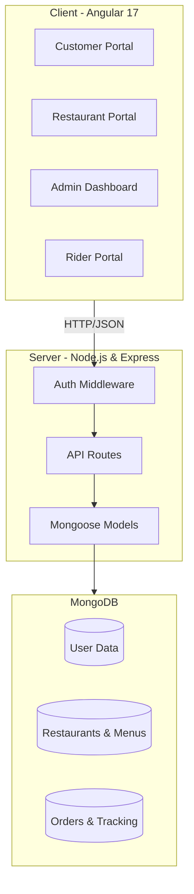

# 🌯 FoodFlow Delivery System - Complete Documentation

Welcome to the official documentation for **FoodFlow**, a premium, full-stack food delivery platform. This document provides a comprehensive overview of the system's architecture, data models, workflows, and technical implementation.

---

## 🏗️ 1. System Architecture

FoodFlow follows a **client-server architecture** using the **MEAN stack** (MongoDB, Express, Angular, Node.js). It is designed to be scalable, maintainable, and provides a seamless real-time experience for multiple user types.

### High-Level Architecture Diagram


---

## 🛠️ 2. Technology Stack

### Backend
- **Node.js**: Runtime environment.
- **Express.js**: Web framework for building REST APIs.
- **MongoDB**: NoSQL database for flexible data storage.
- **Mongoose**: ODM for MongoDB schema validation and modeling.
- **JWT (JSON Web Tokens)**: Secure authentication and authorization.
- **Bcrypt.js**: Industry-standard password hashing.
- **Dotenv**: Management of environment variables.

### Frontend
- **Angular 17**: Modern component-based framework.
- **RxJS**: For reactive programming and handling asynchronous data streams.
- **TypeScript**: Ensuring type safety across the application.
- **Bootstrap / Custom CSS**: Responsive and premium UI design.
- **Angular Router**: Managing complex navigation across four portals.

---

## 📂 3. Project Structure

### Root Directory
```text
food-delivery-system/
├── client/                 # Angular Frontend Application
├── server/                 # Node.js/Express Backend Application
├── README.md               # Quick overview
├── SETUP.md                # Installation guide
├── STRUCTURE.md            # Directory map
└── DOCUMENTATION.md        # This comprehensive guide
```

### Backend (`/server`)
- `server.js`: The entry point of the application. Initializes Express and connects to MongoDB.
- `models/`: Contains Mongoose schemas for all entities (User, Restaurant, Order, etc.).
- `routes/`: Express router files defining all API endpoints.
- `middleware/`: Custom logic like JWT authentication checks.
- `.env`: Sensitive configuration (Database URIs, Secret Keys).

### Frontend (`/client/src/app`)
- `components/`: UI modules organized by user role (admin, customer, restaurant, rider).
- `services/`: Logic for making API calls and shared state management.
- `app-routing.module.ts`: Defines the navigation logic and route guards.
- `app.module.ts`: Root module orchestrating all components and dependencies.

---

## 👥 4. User Roles & Portals

FoodFlow is a multi-tenant platform with four distinct user roles:

### 🛒 Customer Portal
- **Discovery**: Browse restaurants by city or category.
- **Menu Interaction**: View detailed menus with item categories.
- **Cart Management**: Add/remove items, calculate totals dynamically.
- **Order Tracking**: Monitor order status from "Pending" to "Delivered".
- **History**: View past orders and status.

### 🍳 Restaurant Portal
- **Profile Management**: Manage name, description, address, and status (Online/Offline).
- **Menu Management**: Add, edit, or delete items. Toggle item availability.
- **Order Processing**: Accept/Reject orders and update their preparation status.

### 🚴 Rider Portal
- **Delivery Management**: View pending orders ready for delivery.
- **Workflow**: Pick up orders and mark them as delivered.
- **Earnings**: Track completed deliveries.

### 🛡️ Admin Dashboard
- **Platform Overview**: High-level statistics (Total users, restaurants, revenue).
- **User Management**: Monitor and manage all platform users.
- **Vendor Approval**: Approve or suspend restaurants.
- **System Settings**: Manage global cities and categories.

---

## 💾 5. Data Model (Database Schemas)

### User Schema (`models/User.js`)
- `name`: Full name.
- `email`: Unique identifier for login.
- `password`: Hashed using Bcrypt.
- `role`: 'admin', 'customer', 'restaurant', or 'rider'.

### Restaurant Schema (`models/Restaurant.js`)
- `userId`: Reference to the User owner.
- `name`, `description`, `address`, `city`, `phone`.
- `image`: URL for the restaurant banner.
- `isActive`: Boolean flag for platform visibility.

### Order Schema (`models/Order.js`)
- `customerId`: Reference to the customer.
- `restaurantId`: Reference to the restaurant.
- `riderId`: Reference to the assigned rider (optional until picked up).
- `items`: Array of objects (menuItemId, name, price, quantity).
- `status`: 'pending', 'accepted', 'preparing', 'ready', 'picked-up', 'delivered', 'cancelled'.
- `totalAmount`: Final cost.

### MenuItem Schema (`models/MenuItem.js`)
- `restaurantId`: Owner reference.
- `name`, `price`, `description`, `category`.
- `isAvailable`: Inventory toggle.

---

## 🔄 6. Working Model & Flow

### A. Authentication Flow
1. User submits credentials to role-specific login endpoints (e.g., `/api/auth/login`).
2. Server validates password and generates a **JWT**.
3. JWT is returned to the client.
4. **Client-Side Session Management**: 
   - **Customers, Restaurants, Riders**: Session data and tokens are stored in `localStorage`.
   - **Admins**: Session data and tokens are stored in `sessionStorage` for enhanced security.
5. Client includes the JWT in the `Authorization` header for all subsequent protected requests.

### B. Routing & Access Control
The frontend uses **Angular Route Guards** (`AuthGuard`) to prevent unauthorized access.
- **Role-Based Guards**: Routes like `/admin`, `/restaurant`, and `/rider` are protected and require a valid token and the correct user role.
- **Redirection**: If a user attempts to access a portal without the required role, they are redirected to the login page.

### C. Order Lifecycle
1. **Creation**: Customer places an order (Status: `pending`).
2. **Acceptance**: Restaurant receives notification and accepts (Status: `accepted`).
3. **Preparation**: Restaurant moves order to `preparing` then `ready`.
4. **Assignment**: Rider sees the `ready` order and picks it up (Status: `picked-up`).
5. **Completion**: Rider delivers the food (Status: `delivered`).

### D. Data Synchronization
The Angular frontend uses **RxJS Observables** (specifically `BehaviorSubject` in `AuthService`) to manage user states. When a user interacts with the UI, the service layer makes an HTTP call, and upon success, the UI updates the local state to reflect the changes immediately across all relevant components.

---

## 🌐 7. API Reference (Core Endpoints)

| Endpoint | Method | Role | Description |
| :--- | :--- | :--- | :--- |
| `/api/auth/register` | POST | Public | Register a new user |
| `/api/auth/login` | POST | Public | Authenticate user & get token |
| `/api/customer/restaurants` | GET | Customer | List all active restaurants |
| `/api/customer/order` | POST | Customer | Place a new order |
| `/api/restaurant/menu` | GET/POST | Restaurant | Manage menu items |
| `/api/restaurant/orders` | GET | Restaurant | View incoming orders |
| `/api/rider/pending` | GET | Rider | View orders ready for pickup |
| `/api/admin/stats` | GET | Admin | System-wide analytics |

---

## 🚀 8. Setup & Development

### Prerequisites
- Node.js installed.
- MongoDB instance (Local or Atlas).

### Quick Start
1. **Server**: `cd server && npm install && npm run dev`
2. **Client**: `cd client && npm install && npm start`

For detailed environment configuration and seeding instructions, please refer to **[SETUP.md](SETUP.md)**.

---

## 🔒 9. Security & Best Practices

- **Password Hashing**: Never stores plain-text passwords.
- **Stateless Auth**: Uses JWT to avoid server-side session overhead.
- **Input Validation**: Mongoose schemas enforce data integrity at the database level.
- **Route Protection**: Angular Route Guards prevent unauthorized access to role-specific portals (e.g., a customer cannot access `/admin`).

---

*Documentation maintained by the FoodFlow Engineering Team.*
